 

   

 

<h2>🗒️ Project Description</h2>

 
Click-BOOM! is a game created as a fun project/learning experience involving the player strategically purchasing and igniting fireworks in order to get their score as high as possible with a limited number of clicks. Show off your skills of timely and limited ignitions and accuracy, buy multiple different unique fireworks (all with their own challenges), upgrade your abilities, and ignite the sky with a fireworks show that will be remembered for the rest of time!

  This project was created to familiarize myself with aspects of rapid prototyping and UI/UX development.
Some aspects of this project include:
  - Utilization of the concept of tweening (animation through code) in order to create a user-friendly and eye-catching interface while also minimizing performance impacts without relying on Unity's animation system.
  - Gameplay balancing and complex progression system development
  - Basic implementation of an online leaderboard API for keeping track of player scores

There are some additional elements that were a part of this project, such as utilization of render textures to create a pixel perfect art-style, powerups, and basic multi-scene management within Unity.

 

<h2>⬇️ Completed Project Download</h2>
This project is fully playable and available on my itch.io page!  
It can be viewed and downloaded here: https://coba-platinum.itch.io/click-boom

  

*Coba Platinum is an alias that I have used since highscool when releasing anything to the public!

 

<h2>📦 Project Repository</h2>
This project is fully available in this repository!

 

  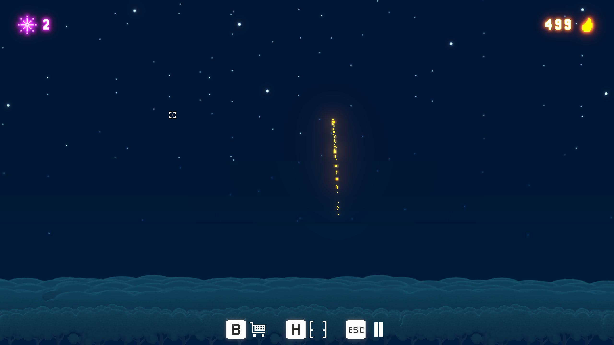
  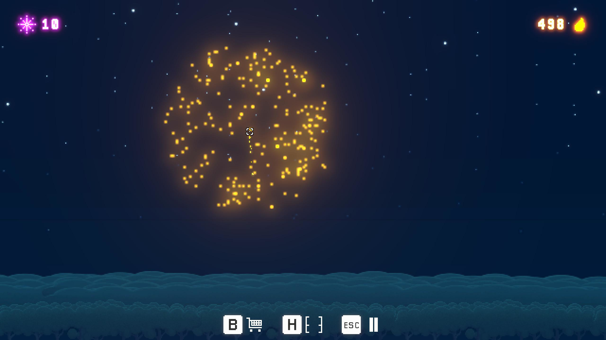

  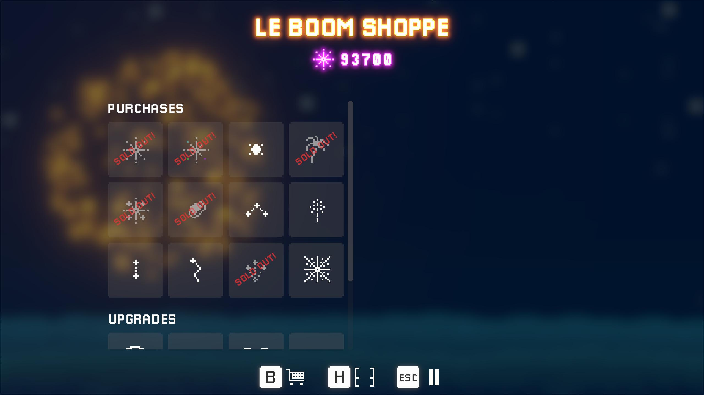
  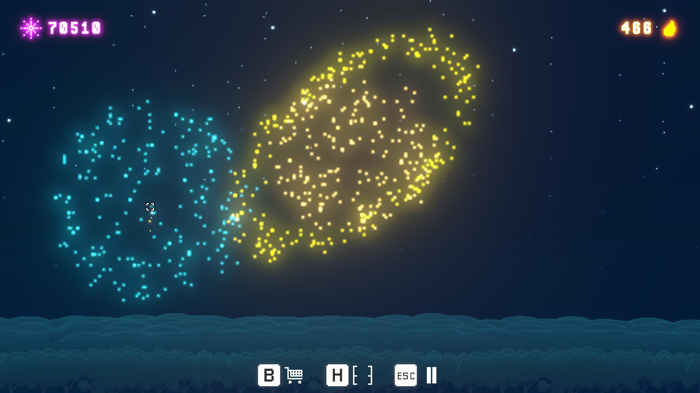

 

<h2>🛠️ Tools Used</h2>

 

 [Unity] - Primary Game Engine

 [Git] - Source Control

 

 

  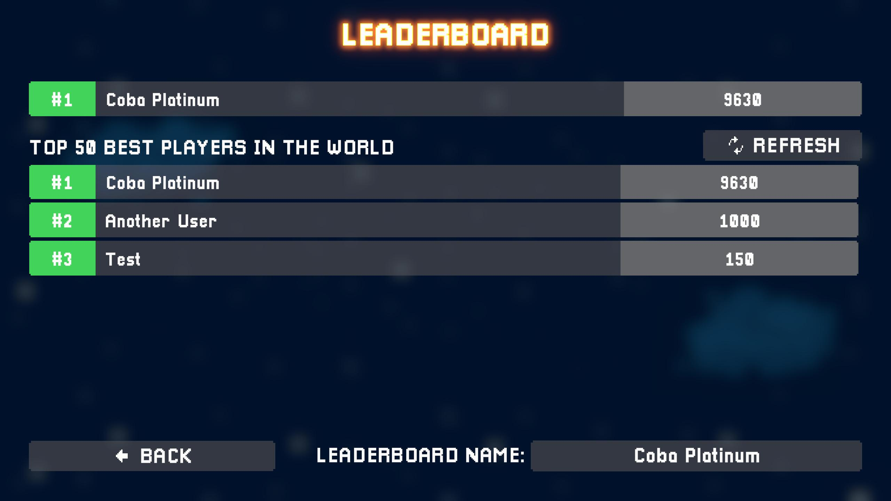
  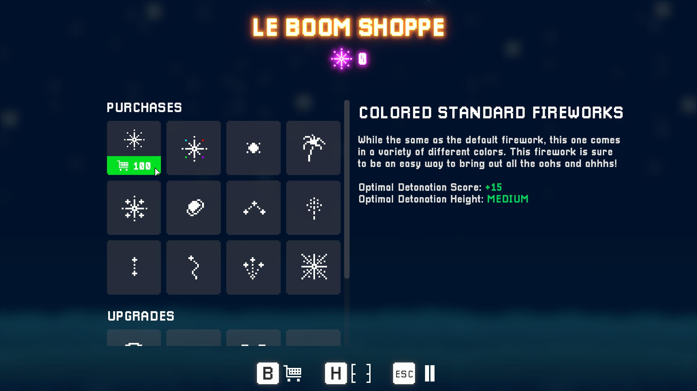

  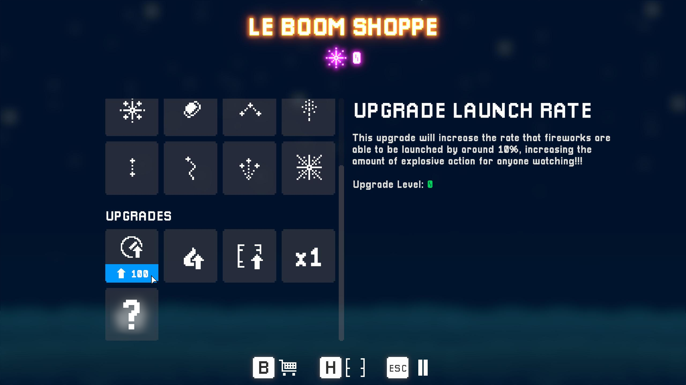
  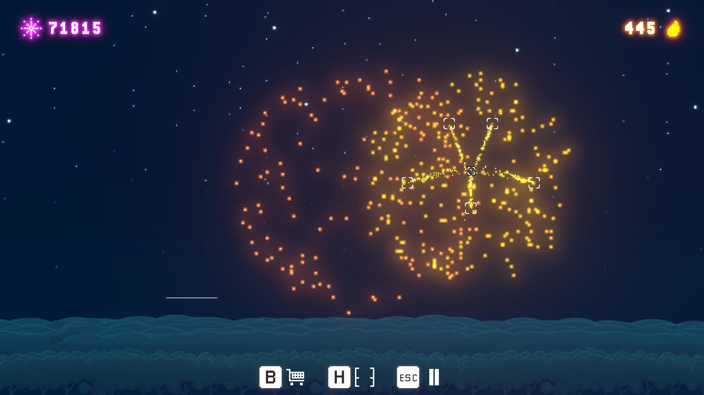

  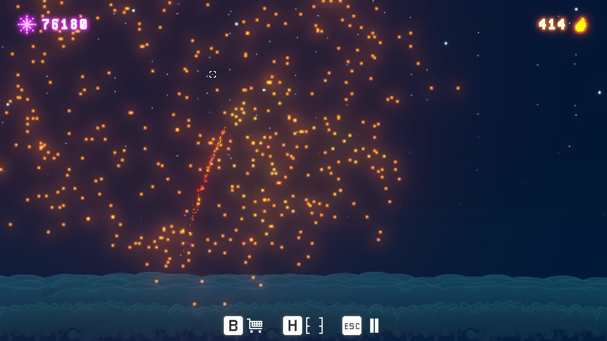
  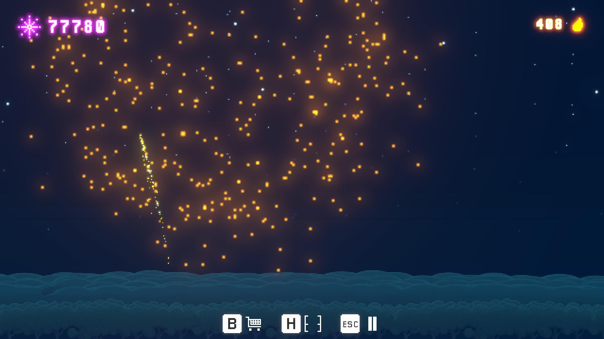

  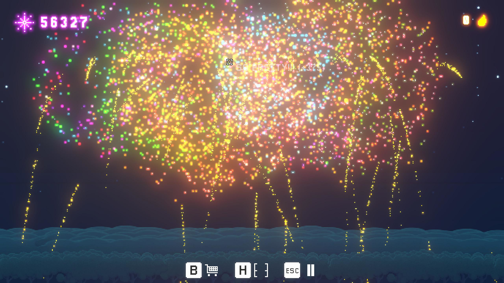

 

<h2>🧠 Project Reflection</h2>

- **How would you describe the process of creating and polishing the artifact?**
  
I feel that creating and polishing this artifact was very enjoyable and challenging. Learning about the concept of tweening was a very interesting and rewarding experience, as there are many benefits to utilizing this concept within development of animated user interfaces. I feel the most challenging aspect of developing this project was testing and balancing the gameplay in order to ensure a good pace of progression throughout the game, as the game is designed to be played in one session with no way to save your project. As I learned more, this project definitely evolved and changed throughout development. Some gameplay elements were not as enjoyable once prototyped and tested, and therefore scrapped or changed to ensure both enjoyability and replayability within the game.
  
- **What did you learn as you were creating it and improving it?**

I believe this project really gave me a great opportunity to refine my prototyping skills, allowing me to implement and test different gameplay systems in the most time-efficient way possible. This allowed me to test a lot more interesting gameplay elements, as large amounts of time were not wasted if a gameplay element ended up not fitting well within the final project and needing to be redeveloped or removed.

- **What challenges did you face?**

As mentioned in the first section, majority of the challenges faced within the development of this game were related to balancing the gameplay so that the progression through purchasing new fireworks and upgrades feels logical and smooth throughout the entire game while also being replayable.

- **How could this artifact be improved?**

There are many different aspects of this project that I feel could be improved, but if I were to work on the project again, my top priority would probably be to overhaul the public leaderboard system to make it much more robust, especially if players attempt to play the game on multiple different devices/platforms with the same username/account. I believe I could also add some more gameplay systems, such as different game modes, to allow the user to try some different play-styles with similar/the same gameplay elements.

 

 

  

